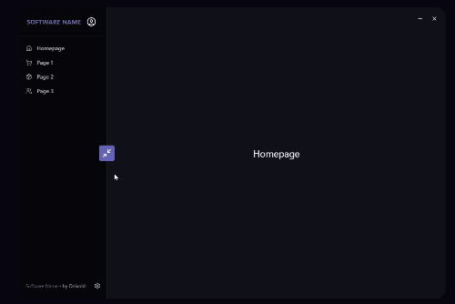

# TaurineCN (Fork)


Ce projet est un **fork** de [TaurineCN](https://github.com/Onivoid/TaurineCN), un template [Next.js](https://nextjs.org/) intégré avec [Tauri](https://tauri.app/), [TailwindCSS](https://tailwindcss.com/), [Shadcn](https://ui.shadcn.com), et [Zustand](https://github.com/pmndrs/zustand). Il a été initialisé avec `create-next-app` en suivant la [Documentation de Tauri](https://tauri.app/fr/v1/guides/getting-started/setup/next-js).



---

## Fonctionnalités

Cette application propose les fonctionnalités suivantes :

- **Édition de tableaux dynamiques** : Ajoutez, modifiez ou supprimez des lignes dans un tableau interactif.
- **Navigation sécurisée** : Une alerte s'affiche si vous essayez de quitter la page avec des modifications non enregistrées.
- **Sauvegarde locale** : Les données du tableau sont sauvegardées dans un fichier local `data.json` grâce à l'API de Tauri.
- **Interface utilisateur moderne** : Utilisation de TailwindCSS et Shadcn pour une expérience utilisateur fluide et esthétique.
- **Gestion d'état** : Utilisation de Zustand pour gérer l'état global de l'application.
- **Support multiplateforme** : Fonctionne sur Windows, macOS et Linux grâce à Tauri.

---

## Prise en main

### Prérequis

Assurez-vous d'avoir installé les dépendances suivantes sur votre machine :

- **Node.js** (version recommandée : 16+)
- **Pnpm** (ou un autre gestionnaire de paquets comme Yarn ou npm)
- **Rust et Cargo** (pour Tauri)
- **Make** (pour exécuter les commandes définies dans le [Makefile](./Makefile))

### Installation

Clonez le dépôt et installez les dépendances :

```bash
git clone https://github.com/Onivoid/TaurineCN.git

cd TaurineCN

npm install
# ou
yarn install
# ou
pnpm install
# ou
bun install
```

> ⚠️ **Avant de continuer** ⚠️ : Si vous n'utilisez pas pnpm, vous allez devoir changer les commandes dans le [Makefile](./Makefile) avant de continuer

### Démarrer le serveur de développement

Pour démarrer le serveur de développement Tauri, utilisez la commande suivante définie dans le Makefile :

```bash
make dev
```

### Autres commandes Makefile

- Pour formater le code :

  ```bash
  make format
  ```

- Pour lancer l'analyse statique du code :

  ```bash
  make lint
  ```

- Pour formater et analyser le code :

  ```bash
  make check
  ```

## Licence

Ce projet est sous licence MIT. Voir le fichier [LICENSE](./LICENSE) pour plus de détails.